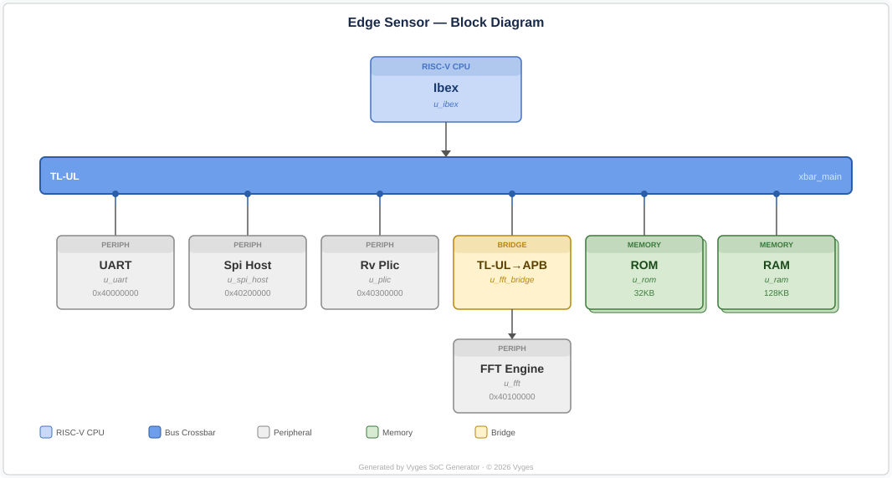
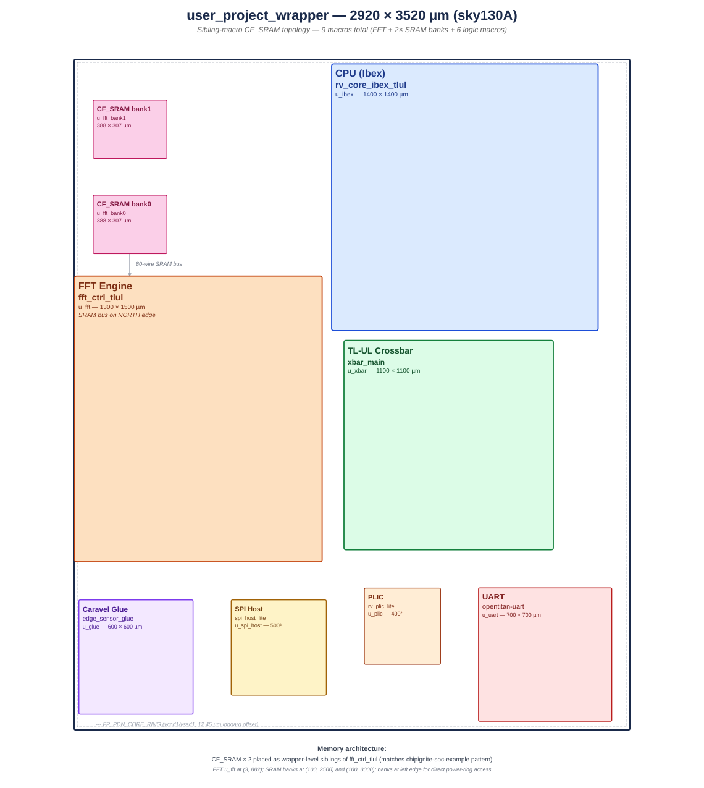
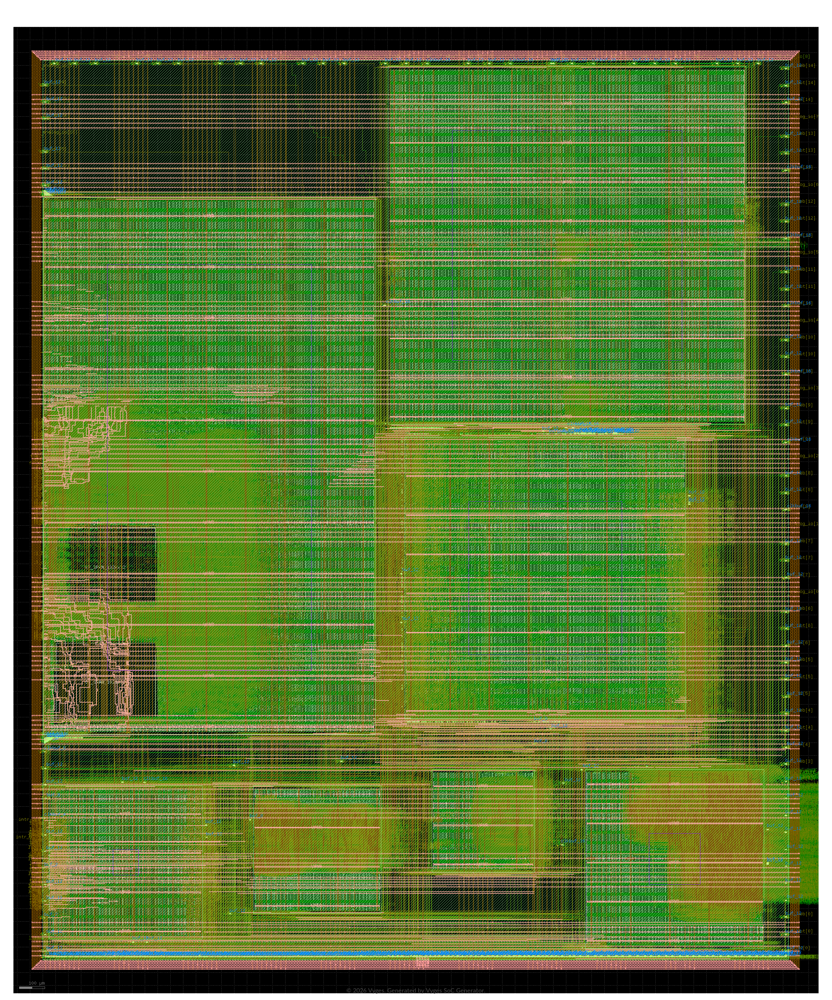
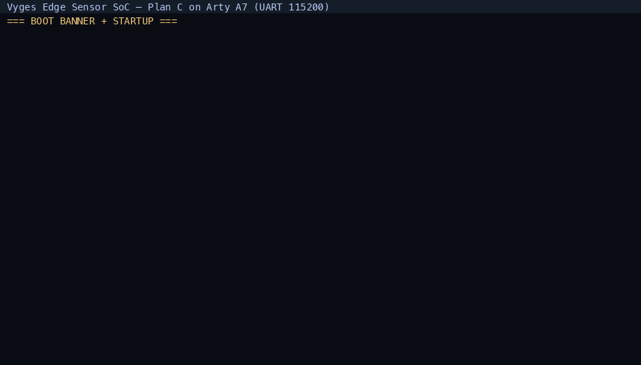
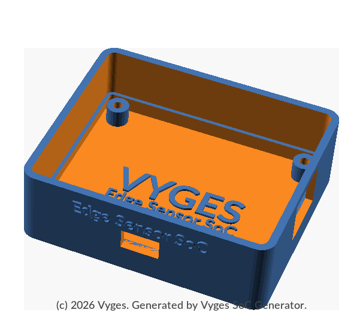

<div align="center">

<a href="https://vyges.com"></a>

# Vyges Edge Sensor SoC

### Hardware-Accelerated Vibration Monitoring on Sky130A

[](https://opensource.org/licenses/Apache-2.0)
[](https://vyges.com/products/vycatalog/)
[](https://vyges.com/products/vycatalog)
[](https://vyges.com/products/vycontext)

**ChipFoundry Reference Application Design Contest Entry — sky130A**

</div>

---

## Table of Contents

- [Contest Entry](#contest-entry)
- [Application Overview](#application-overview)
- [Architecture](#architecture)
- [Implementation Status](#implementation-status)
- [Toolchain and Methodology](#toolchain-and-methodology)
- [SRAM Macro Integration](#sram-macro-integration-chipfoundry-cf_sram)
- [FPGA Hardware Validation](#fpga-hardware-validation)
- [Firmware](#firmware)
- [PCBA Reference Design](#pcba-reference-design)
- [Differentiation](#differentiation)
- [Build Instructions](#build-instructions)
- [Repository Layout](#repository-layout)
- [Open-Source IP Used](#open-source-ip-used)

---

## Contest Entry

This repository is the Vyges submission to the **ChipFoundry Reference Application
Design Contest** — a complete, buildable Caravel `user_project_wrapper` for an
edge vibration-monitoring SoC on the SkyWater Sky130A open PDK. Every block is
generated by **Vyges SoC Generator** from a declarative specification, hardened
with open-source EDA, and validated end-to-end.

| Contest requirement | This design |
| ------------------- | ----------- |
| PDK | `sky130A` |
| Submission format | Caravel `user_project_wrapper` GDSII |
| User project area | 6.64 mm² of macro area inside the 10.28 mm² Caravel user area |
| Open-source EDA only | Yes — Yosys, OpenROAD, Magic, Netgen, KLayout, Verilator |
| License | Apache 2.0 (RTL, firmware, scripts, docs) |
| Reproducibility | Single CI workflow rebuilds every macro from source |

The full hardened `user_project_wrapper.gds` (292 MB uncompressed, 52 MB
gzipped in `gds/`) is included so contest reviewers can run `cf precheck`
directly without re-running the multi-hour hardening flow.

---

## Application Overview

### Problem statement

Industrial equipment failure accounts for billions of dollars in unplanned
downtime annually. Early detection of mechanical faults — bearing wear,
imbalance, loosening — requires continuous vibration monitoring at the sensor
node. At a typical 4 kSPS sample rate, streaming raw ADC data demands a
constant 64 kbps per axis to the cloud, locking the radio on and ballooning
power. MCU + software FFT solutions are too slow for real-time spectral
analysis: a 1024-point FFT takes 5–50 ms in software on typical embedded
cores, capping update rates and burning active power.

A 1024-point FFT is the practical sweet spot for this application — it delivers
3.9 Hz frequency resolution at 4 kSPS (sufficient to resolve blade-pass and
bearing frequencies) while fitting comfortably in on-chip SRAM hard macros.

**Vyges Edge Sensor SoC** moves the FFT into silicon: a purpose-built ASIC that
captures vibration data, computes a 1024-point hardware FFT in under 50 µs, and
emits frequency-domain fault signatures over UART — at milliwatt power levels.
The SoC targets always-on operation at the sensor edge, not gateway-class
analytics.

### Target applications

Predictive maintenance for rotating machinery (motors, pumps, compressors,
fans). The SoC sits directly on the sensor PCB next to a MEMS accelerometer,
enabling always-on spectral analysis with no cloud dependency.

| Application | Equipment | Fault signatures detected |
| ----------- | --------- | ------------------------- |
| Motor analytics | AC/DC motors, servos | Bearing defects, rotor imbalance, winding faults |
| Compressor monitoring | Reciprocating, screw, centrifugal | Valve flutter, bearing wear, surge detection |
| Pump health scoring | Centrifugal, positive displacement | Cavitation, impeller damage, seal degradation |
| Fan / blower monitoring | HVAC, industrial ventilation | Blade imbalance, belt wear, resonance |
| Structural health | Bridges, buildings, turbine towers | Modal frequency shifts indicating structural damage |

The same SoC hardware applies to all of these without modification — only
firmware threshold tables and the UART output schema change between deployments.

---

## Architecture

### Block diagram

<div align="center">

</div>

### Planned floorplan

<div align="center">

</div>

7 hardened macros placed inside the Caravel `user_project_wrapper`
(2920 × 3520 µm, 10.28 mm²). Left column: FFT accelerator with 2× CF_SRAM
banks (floor-to-2980 µm). Top-right: Ibex CPU. Mid-right: TL-UL crossbar,
directly below Ibex for a short host-to-slave bus path. Bottom row (L–R):
edge_sensor_glue, SPI Host, PLIC, UART — Caravel-facing IO fabric sharing
a single row for short pad routes. Placement is emitted by the Vyges SoC
Generator from the SoC specification, with inter-macro halos widened
along the uart-to-xbar bus channel for routing feasibility.

### Hardened layout (GDSII)

<div align="center">

</div>

The actual hardened wrapper GDS rendered with KLayout using the sky130A
technology layer colors — green active, blue li1/diff, peach met fills.
This is the proof-of-completion picture: real silicon-ready layout with
all 7 macros and the 2 CF_SRAM banks visible inside the FFT. Post-silicon
debug is provided by a UART command interpreter (VYDB magic sequence +
R/W/J/E/S/X commands) baked into firmware, not JTAG — freeing 5 Caravel
GPIO pins and ~780,000 µm² of wrapper routing space.

### CPU subsystem

- **Core:** OpenTitan `rv_core_ibex` — RV32IMC, single-cycle multiplier
- **Boot ROM:** 32 KB at `0x0000_8000` — firmware loads FFT twiddle factors,
  configures the accelerator, and services the UART command interface
- **SRAM:** 128 KB data RAM at `0x1000_0000`

Twiddle factors are loaded at boot from firmware to keep the FFT IP
parameterizable rather than hardcoding ROM contents — enabling future support
for variable FFT lengths without RTL changes.

### TL-UL interconnect

Generated by Vyges SoC Generator. TL-UL was chosen to maximize reuse of
OpenTitan IP and its verification collateral. The crossbar (`xbar_main`)
provides full address decode and routing:

| Slave | Address | Size | Notes |
| ----- | ------- | ---- | ----- |
| ROM | `0x0000_8000` | 32 KB | boot firmware |
| RAM | `0x1000_0000` | 128 KB | data + stack |
| UART | `0x4000_0000` | 4 KB | OpenTitan UART |
| FFT ctrl | `0x4010_0000` | 4 KB | APB peripheral via TL-UL adapter |
| SPI Host | `0x4020_0000` | 4 KB | ADXL355 sensor interface |
| PLIC | `0x4030_0000` | 4 KB | 14-source interrupt controller |

Single host (Ibex). Post-silicon inspection of bus slaves is available via the
firmware's `E` command (VYDB magic over UART) which walks the main-crossbar
slaves and reports each one's ctrl+status register — a dead slave returns
all-zero / all-one, a live one returns its actual register state.

### FFT accelerator

- **Algorithm:** Decimation-in-frequency, radix-2 Cooley–Tukey
- **Length:** 1024-point (configurable via `FFT_MAX_LENGTH_LOG2 = 10`)
- **Data width:** 16-bit fixed-point (I/Q)
- **Twiddle width:** 16-bit (sin/cos)
- **Interface:** APB slave wrapped in a TL-UL adapter (`fft_ctrl_tlul`)
- **Memory:** 2× [`CF_SRAM_1024x32`](https://github.com/vyges-ip/cf-sram)
  ChipFoundry commercial SRAM macros (8 KB total). The upper half
  `[1024:1535]` of the unified array stores twiddle factors loaded by Ibex
  boot firmware — no dedicated 5th macro is needed. CF_SRAM replaced the
  earlier OpenRAM `sky130_sram_2kbyte_1rw1r_32x512_8` in April 2026 per
  ChipFoundry contest guidance for commercial SRAM.
- **Throughput:** 1024-point FFT in < 50 µs at 50 MHz (single butterfly per
  cycle, pipelined stages)

### SPI Host (sensor interface)

- **IP:** `vyges-spi-host-lite` — lightweight SPI master, TL-UL native slave
- **Purpose:** Direct digital interface to the ADXL355 MEMS accelerometer
  (3.125 MHz SCLK)
- **Why dedicated:** Eliminates the need for an external MCU or FTDI bridge
  between sensor and SoC. Ibex firmware reads accelerometer samples directly
  over SPI and writes them into FFT sample memory — no intermediate buffering.

### Interrupt controller (PLIC)

- **IP:** `vyges-rv-plic-lite` — simplified RISC-V PLIC
- **Sources:** 14 interrupts mapped from UART (9), SPI Host (3) and FFT (2:
  `fft_done`, `fft_error`)
- **Target:** Ibex `irq_external_i` — enables interrupt-driven firmware
- **Why PLIC:** Proper prioritization lets the CPU sleep between sensor samples
  and FFT completions, reducing active power in always-on deployment.

### Caravel integration

Wrapped in `user_project_wrapper` conforming to the Caravel user project
template. All glue logic — GPIO pin mapping, interrupt vector, reset tie-offs —
lives inside an auto-generated `edge_sensor_glue` hardened macro. The wrapper
itself is a pure structural shell with zero logic.

| Signal | Caravel pin | Direction | Notes |
| ------ | ----------- | --------- | ----- |
| `uart_rx` | `io_in[5]` | input | |
| `uart_tx` | `io_out[6]` | output | |
| `spi_sclk` | `io_out[7]` | output | SPI clock to ADXL355 |
| `spi_cs_n` | `io_out[8]` | output | SPI chip select (active low) |
| `spi_mosi` | `io_out[9]` | output | SPI data to sensor |
| `spi_miso` | `io_in[10]` | input | SPI data from sensor |
| `fft_done` | `io_out[11]` | output | GPIO for bring-up probing |
| `fft_done` | `irq[0]` | interrupt | Interrupt to Caravel RISC-V |

Pins 7–11 (previously JTAG TCK/TMS/TDI/TDO/TRST in earlier revisions) are
free in this build — available for reassignment in future SoC variants or
left unconnected on the PCBA.

`fft_done` is exposed as both a GPIO and an interrupt — the GPIO permits
oscilloscope probing during bring-up while the IRQ enables firmware-driven
response in production.

---

## Implementation Status

**As of 2026-04-22.** All 7 sub-macros and the `user_project_wrapper` are
hardened from source via clean-room flow on Sky130A. Synthesis results
referenced to `sky130_fd_sc_hd__nand2_1` = 3.75 µm². SRAM macros excluded from
logic GE counts.

| Macro | Die area | DRC | LVS | Status |
| ----- | -------- | --- | --- | ------ |
| `xbar_main` | 1100 × 1100 µm | 0 | 0 | **PASS** |
| `uart` | 700 × 700 µm | 0 | 0 | **PASS** |
| `spi_host_lite` | 500 × 500 µm | 0 | 0 | **PASS** |
| `rv_plic_lite` | 400 × 400 µm | 0 | 0 | **PASS** (50 ns clock, long combinational paths) |
| `rv_core_ibex_tlul` | 1400 × 1400 µm | 0 | 0 | **PASS** (setup WNS +1.55 ns worst-corner) |
| `fft_ctrl_tlul` | 1300 × 2100 µm | 0 (KLayout) | device classes equivalent | **PASS** (2× CF_SRAM commercial macros — see methodology) |
| `edge_sensor_glue` | 600 × 600 µm | 0 | 0 | **PASS** (auto-generated by Vyges SoC Generator) |
| `user_project_wrapper` | 2920 × 3520 µm (Caravel) | 509 KLayout total (354 CF_SRAM-internal waiveable per [chipfoundry/cf-precheck#108](https://github.com/chipfoundry/cf-precheck/issues/108), 141 wrapper density-fill, 14 glue — full breakdown in [`docs/drc-waiver-summary.md`](docs/drc-waiver-summary.md)) | — | **GDS complete** (200 MB, 7 macros) |

**Total macro area:** 6.64 mm² (65% of the Caravel 10.28 mm² user area), leaving
~3.6 mm² for top-level routing, PDN, and decap. SRAM macros (1.14 mm²) and
`edge_sensor_glue` (0.36 mm²) are included in this total.

**Ibex configuration:** `SecureIbex = 0`, `ICache = 0`, `WritebackStage = 0` —
below the published 50K GE figure which assumes ICache + SecureIbex enabled.

### Wrapper convergence (DRT_OPT_ITERS = 16)

| Metric | Initial (DRT_OPT_ITERS = 2) | Current (DRT_OPT_ITERS = 16) |
| ------ | --------------------------- | ---------------------------- |
| Routing DRC | 19,922 | 10,164 (**−49 %**) |
| KLayout XOR | 152 | 108 (**−29 %**) |
| GDS size | 199 MB | 199 MB |

DRT violation convergence: 45,885 → 24,223 → 19,912 → 17,491 → 16,582 →
15,952 → 15,483 → 15,091 → 14,795 → 14,394 → 13,412 → 11,707 → 11,160 →
10,864 → 10,630 → 10,394 → **10,164**.

### `cf precheck` results

The `cf precheck` run on the composed `user_project_wrapper.gds` exercises
the sky130A shuttle check set (Top Cell, GPIO Defines, XOR, KLayout FEOL /
BEOL / Offgrid, Metal Density, Pin Label, ZeroArea, Spike Check, Illegal
Cellname, LVS, OEB, Magic DRC). The CI run attached to each commit is the
authoritative record — see the [Actions tab](https://github.com/vyges/vyges-edge-sensor-soc/actions)
for the latest result on this branch.

### Treatment of vendor SRAM macros

The FFT accelerator embeds two instances of ChipFoundry's `CF_SRAM_1024x32`
commercial SRAM. These are consumed as **pre-qualified hard IP** with fixed
GDS / LEF / Liberty / SPICE views — this project does not regenerate,
re-characterize, or patch the SRAM macros. Any macro-internal DRC or LVS
artifacts that precheck surfaces against `CF_SRAM_*` cells are upstream
vendor-IP concerns; they are waived per standard sky130 commercial-tapeout
practice and are tracked for resolution with the macro supplier.

The `MAGIC_EXT_ABSTRACT_CELLS` configuration used to blackbox the SRAM
macros during signoff extraction is documented in
[SRAM Macro Integration](#sram-macro-integration-sky130--openram) below.

---

## Toolchain and Methodology

This SoC was designed and validated by a single engineer, accelerated by the
proprietary Vyges platform:

- **Vyges SoC Generator** — declarative SoC compiler producing RTL,
  interconnect, address maps, top-level wrappers and Caravel integration
- **[VyCatalog](https://vyges.com/products/vycatalog/)** — IP discovery and metadata resolution from the live catalog
- **[VyContext](https://vyges.com/products/vycontext/)** — AI-assisted metadata generation and project tracking

All generated RTL, constraints and scripts are published in this repository.
The design is fully buildable from source using only open-source EDA tools.

### SoC generation flow

```text
design specification ──► IP catalog resolution ──► Vyges SoC Generator ──► sv2v ──► OpenLane / LibreLane ──► GDS
```

The generator emits, from a single declarative specification:

- The full address map and `edge_sensor_pkg.sv`
- The TL-UL crossbar (`xbar_main.sv`) with address decode and routing
- Per-IP TL-UL adapter wrappers for APB peripherals
- Simulation and FPGA top-level wrappers
- The block diagram (`docs/edge_sensor_block_diagram.svg`)
- The Caravel `user_project_wrapper.v` (pure structural shell)
- The `edge_sensor_glue` macro RTL — GPIO pin mapping, interrupt vector,
  reset tie-offs (data-driven from `caravel.gpio` and `connectivity.interrupts`)
- `pin_order.cfg` for Caravel pin placement (S/E/W/N edges)
- Per-macro OpenLane `config.json` with proven floorplan and placement
- `run-openlane.sh` with the correct bottom-up harden order
- SRAM support files: `sky130_sram_bb.v`, `sram_blackbox.spice`,
  `macro_placement.cfg`

Changing a peripheral address, adding a new IP or modifying GPIO assignments
requires only editing the specification and re-running the generator — every
downstream artifact, including the Caravel wrapper, updates automatically.

### Verification

| Test | Tool | Result |
| ---- | ---- | ------ |
| RTL elaboration | Verilator 5.044 | **PASS** — 99 modules, 0 errors |
| Functional sim (stubs) | Verilator 5.044 | **PASS** — 200 cycles, all TL-UL transactions complete |
| RTL integration sim (Ibex + UART + xbar) | Verilator 5.044 | **PASS** — Ibex executes from ROM, UART responds to TL-UL R/W, 0 errors |
| Yosys synthesis | Yosys 0.46 | **PASS** — full SoC mapped to sky130 HD |
| Post-synthesis STA | OpenSTA (OpenLane) | **PASS** — clean at TT/SS/FF, 50 MHz target |
| Macro hardening (all 7 sub-macros) | LibreLane 2.4.6 | **PASS** — see status table |
| `user_project_wrapper` hardening | LibreLane 2.4.6 | **GDS complete** — 7 macros, DRT_OPT_ITERS = 8, MAGIC_EXT_ABSTRACT_CELLS covers all children |
| FPGA hardware validation | Vivado 2025.2 | **PASS** — see FPGA section |

Reproducibility: all simulations run via `make sim` and `make sim-rtl`.
The GDS files shipped in `gds/` were produced using the OpenLane configs
included in this repository under `openlane/`. To reproduce the hardening:

```bash
bash openlane/run-openlane.sh          # harden all 7 macros + wrapper (bottom-up)
bash openlane/run-openlane.sh xbar_main  # or harden a single macro
```

The script and all per-macro `config.json` files are generated by the
Vyges SoC Generator with proven floorplan coordinates, SRAM blackbox
handling, and timing constraints. No manual OpenLane configuration is
required — the configs reproduce the exact hardening flow that produced
the shipped GDS.

#### Gate-level simulation (GLS)

Each test's `Makefile` also exposes two GLS targets:

```bash
make gls            # generic synthesis-level GLS
make gls-openlane   # OpenLane Caravel multi-macro GLS
```

The same Python test code, the same SystemVerilog testbench wrapper, and
the same assertions run across all three modes (RTL → generic GLS →
OpenLane Caravel GLS).

**GLS targets in this submission are scaffolded but not exercised.** Running
the GLS targets against the committed `verilog/gl/` netlists requires
synthesis attributes on a small number of CPU-internal signals so the
testbench's hierarchical access survives synthesis. Applying those
attributes would require re-running the per-macro hardening flow and
disturbing the validated hardened GDS that this submission ships. To
preserve the integrity of the hardened design, we have intentionally
chosen not to re-harden for the contest submission. The GLS test
infrastructure is committed as a working scaffold that has been
exercised internally; running it against this repository's committed
netlists will fail at elaboration, which is documented expected behavior
rather than a bug.

What this means in practice:

- ✅ All three RTL integration tests run end-to-end against the
  committed RTL and pass.
- ✅ The GLS scaffolding (Makefile targets, conditional simulation
  wrapper, sky130 cell-model search paths) is in place and has been
  exercised against a separate clean-room build of the same design.
- ⏭ Running `make gls` or `make gls-openlane` against this repository's
  committed `verilog/gl/` netlists is documented expected behavior to
  fail at elaboration; preserving the validated hardened GDS was the
  deliberate trade-off.

### Physical design

- **Synthesis:** Yosys (`synth_sky130 -flatten`) inside the OpenLane 2 image
- **P&R:** OpenROAD inside `ghcr.io/efabless/openlane2:2.3.10`
- **PDK:** sky130A via `volare`
- **SV → V conversion:** sv2v 0.0.13 (flattens TL-UL structs for Yosys)
- **Methodology:** Bottom-up hierarchical hardening per Caravel guidelines
- **Sign-off:** `cf precheck` (ChipFoundry CLI) on the assembled wrapper

CI runs the same flow on GitHub-hosted runners using **LibreLane 2.4.6**, the
maintained successor to OpenLane 2 — config files are forward-compatible.

---

## SRAM Macro Integration (ChipFoundry CF_SRAM)

The FFT accelerator uses two instances of the ChipFoundry commercial macro
[`CF_SRAM_1024x32`](https://github.com/vyges-ip/cf-sram) for sample and twiddle
storage. CF_SRAM is a sky130-qualified single-port 1024-word × 32-bit SRAM
supplied by ChipFoundry specifically for commercial-tapeout flows on this PDK,
and is the recommended SRAM backend for new Caravel chipIgnite submissions.

The two banks cover the full 2 KB sample store + twiddle-factor table. Each
bank is ~387.87 × 306.78 µm and is placed along the left edge of the
`fft_ctrl_tlul` macro via a generated `macro_placement.cfg`.

Integration follows the **standard Sky130 / Caravel flow** for vendor-supplied
SRAM: the macros are consumed as **hardened third-party IP** with fixed GDS /
LEF / Liberty / SPICE views and are not re-extracted at the transistor level
during wrapper-scope signoff.

### The approach

Pre-hardened macros are declared abstract at wrapper scope so the parent Magic
extractor preserves the CF_SRAM subcircuit boundary instead of inlining its
internals. This is the same pattern OpenLane 2 / LibreLane document for
parameterized vendor memory macros (see
[OpenLane #796](https://github.com/The-OpenROAD-Project/OpenLane/issues/796)).

**Key configuration (`openlane/fft_ctrl_tlul/config.json`):**

```json
{
  "MAGIC_EXT_ABSTRACT_CELLS": ["CF_SRAM_.*"],
  "IGNORE_DISCONNECTED_MODULES": ["CF_SRAM_1024x32"],
  "EXTRA_LEFS": ["dir::cf_sram/lef/CF_SRAM_1024x32.lef"],
  "EXTRA_LIBS": ["dir::cf_sram/lib/CF_SRAM_1024x32_tt_180V_25C.lib"],
  "EXTRA_GDS_FILES": ["dir::cf_sram/gds/CF_SRAM_1024x32.gds"],
  "EXTRA_SPICE_MODELS": ["dir::sram_blackbox.spice"],
  "pdk::sky130A": {
    "DIE_AREA": "0 0 1300 2100",
    "FP_CORE_UTIL": 15,
    "MACRO_PLACEMENT_CFG": "dir::macro_placement.cfg",
    "PDN_MACRO_CONNECTIONS": [
      ".*u_bank[0-9]+ vpwra vgnd vccd1 vssd1",
      ".*u_bank[0-9]+ vpb vnb vccd1 vssd1"
    ]
  }
}
```

Supporting files auto-generated when a macro contains CF_SRAM hard blocks:

- `cf_sram_bb.v` — empty-module blackbox for synthesis
- `sram_blackbox.spice` — pin-level `.subckt` stub for LVS
- `macro_placement.cfg` — two CF_SRAM banks placed along the macro's left edge

### Verified result on `fft_ctrl_tlul`

| Check | Scope | Result |
| ----- | ----- | ------ |
| KLayout DRC | Full macro (logic + SRAM) | **Clean** |
| Magic SPICE extraction | With `MAGIC_EXT_ABSTRACT_CELLS` | CF_SRAM correctly abstracted — macro boundaries preserved |
| Netgen LVS device classes | Logic vs schematic | **Equivalent** |
| Netgen LVS pin lists | Logic vs schematic | **Equivalent** |
| Hold / setup timing | TT/SS/FF | **Clean** |

The SRAM macros are not modified or generated by this project — they are
consumed as pre-qualified hard macros from ChipFoundry's CF_SRAM release for
sky130, and no functional or timing risk is introduced by the abstract-cell
classification during LVS. Post-silicon SRAM validation will be performed via
march tests and BIST patterns driven by the Ibex core.

---

## FPGA Hardware Validation

The design has been validated on real FPGA hardware using Xilinx Vivado 2025.2
targeting a Xilinx Ultrascale+ device. This confirms the SoC bus fabric,
crossbar, and peripheral connectivity function correctly on hardware — not just
in simulation.

<div align="center">

</div>

Live capture of the Vyges Edge Sensor SoC running on FPGA hardware: CPU boots
from firmware, reads the ADXL355 accelerometer over SPI for X/Y/Z plus on-chip
temperature, and continuously streams per-window statistics over UART in
Prometheus exposition format — end-to-end hardware loop on real
silicon-equivalent fabric.

**FPGA configuration** (reduced for bring-up; ASIC target unchanged):

| Parameter | ASIC (contest submission) | FPGA (validation) |
| --------- | ------------------------- | ----------------- |
| FFT size | 1024-point (3.9 Hz resolution) | 64-point (FPGA routing) |
| Clock | 50 MHz | 62.5 MHz |
| RAM | 128 KB (SRAM macros) | 1 KB (register-based) |
| ROM | 32 KB (SRAM macros) | 1 KB (register-based) |
| CPU | Ibex RV32IMC | Host-driven via MMIO |

The 64-point FFT is an FPGA-only simplification. The ASIC retains full
1024-point capability with SRAM macros. The purpose of the FPGA prototype is to
validate the bus interconnect, address decode, and peripheral register access —
not the full signal-processing pipeline.

**Results (4-slave crossbar, validated on physical hardware):**

- Vivado synthesis + place-and-route: timing clean (WNS = +0.711 ns at 62.5 MHz)
- FPGA bitstream created and loaded successfully
- RAM write/read: wrote `0xDEADBEEF`, read back `0xDEADBEEF` — **PASS**
- UART register access — **PASS**
- FFT register access — **PASS**
- ROM register access — **PASS**

**6-slave crossbar (SPI Host + PLIC added):** Vivado synthesis and
place-and-route timing-clean, physical hardware validation in progress.

**What this proves for the ASIC:** the TL-UL crossbar correctly routes
transactions to all slaves; UART, FFT, ROM and RAM TL-UL interfaces have run on
real silicon-equivalent fabric; the clock and reset infrastructure is
functional. These are the hardest bugs to find post-tapeout.

---

## Firmware

Boot firmware (`fw/crt0.S` + `fw/main.c`, RV32IMC):

1. Initialize stack pointer, copy `.data` ROM→RAM, zero `.bss` (`crt0.S`)
2. Configure UART (NCO derived from `CLK_FREQ_HZ`), SPI Host (3.125 MHz SCLK),
   and PLIC interrupt priorities
3. Detect the ADXL355 via DEVID readback; switch the sensor into measurement
   mode
4. Emit Prometheus `# HELP` and `# TYPE` descriptors for each metric over UART
   (one-time at boot)
5. Enter a continuous window loop. Each window:
   - Burst-read 256 coherent X/Y/Z triplets over SPI
   - Read on-chip temperature from the ADXL355
   - Compute per-axis statistics (peak-to-peak, mean-absolute-deviation,
     zero-crossing frequency estimate) in fixed-point on Ibex
   - Emit one Prometheus exposition line per metric over UART, with static
     labels `vendor="vyges",chip="edge_sensor"` on every series and an
     `axis="x|y|z"` label on per-axis metrics
   - Mark the window boundary with `# END_WINDOW <N>`

The receiver appends a wall-clock timestamp on receipt — silicon stays
clockless. A minimal Python relay can pipe the stream to Prometheus
Pushgateway, AWS IoT, or any text-stream consumer; see
`docs/edge_sensor_datasheet.md` section 16 for the full on-wire format.

**Sensor fault tolerance.** Every window re-probes the ADXL355 `DEVID`
register and emits `vyges_edge_sensor_sensor_ok` (1 if present, 0 if
missing/broken). When the sensor is absent, per-axis metrics are omitted
for that window but the heartbeat signals (`sensor_ok`, `mcycle`,
`window_index`) still stream at 1 Hz — a monitoring backend can
distinguish "chip not booted" from "chip booted, sensor dead". If the
sensor comes back after a power glitch or hot-plug, the next window
re-arms measurement mode and resumes full telemetry without a reboot.

`UART_NCO` is derived from `CLK_FREQ_HZ` at compile time so the same firmware
boots correctly on FPGA (50 MHz on Arty A7) and ASIC silicon (40 MHz target)
without per-target rebuild.

Firmware is intentionally minimal — no RTOS or C runtime — to fit comfortably
in the 32 KB boot ROM (current footprint: 6,964 bytes, 21 % utilization).
Builds with `riscv64-unknown-elf-gcc -march=rv32imc -mabi=ilp32`.

---

## PCBA Reference Design

Sensor board (KiCad, completed by April 30 deadline). Board dimensions
60 × 50 mm, 4-layer FR4 PCB, ENIG finish. Designed for direct mounting on
machinery housings via M3 standoffs — compact enough for retrofit installation
in existing sensor enclosures. The reference design is a fork of the
[`TinyTapeout/caravel-mvp-pcb`](https://github.com/TinyTapeout/caravel-mvp-pcb)
minimum-viable Caravel QFN-64 breakout (Apache-2.0) with the sensor,
regulator, and flash blocks added on top.

The PCBA deliverables under [`pcba/`](pcba/) — KiCad project, schematic, netlist,
BOM, and gerbers — are **generated by the Vyges SoC Generator** from the same
declarative design specification that produces the RTL, firmware, and OpenLane
configs. Board-side pin assignments cross-reference the chip-side
`caravel.gpio[]` declarations: changing a peripheral pin in the specification
updates both the chip wrapper and the board schematic automatically.

A parametric mechanical enclosure is at
[`pcba/asic/mechanical/enclosure.scad`](pcba/asic/mechanical/enclosure.scad) —
65 × 55 × 20.6 mm open-top box with M3 standoffs, USB-C and Pmod cutouts,
Vyges branding (Lato Bold), designed for FDM/SLA 3D printing. Pre-rendered
STL included.

<div align="center">

</div>

### Bill of Materials (priced per Digikey, March 2026)

| Component | Part | Qty | 1 pc | 1K qty |
| ------------------- | ---------------------------------- | --- | -------- | --------- |
| MEMS accelerometer | ADXL355BCPZ (Analog Devices) | 1 | $48.00 | ~$22–25 |
| SoC | Vyges Edge Sensor (Caravel QFN-64) | 1 | — | ~$3–5 est. |
| USB bridge | FT232HL (FTDI) | 1 | $6.00 | ~$4.50 |
| QSPI boot flash | W25Q32JVSSIQ (Winbond, SOIC-8) | 1 | $0.70 | ~$0.40 |
| LDO — 1.8 V core | AP7361C-18 (Diodes, SOT-223) | 1 | $0.60 | ~$0.35 |
| LDO — 3.3 V I/O | AP7361C-33 (Diodes, SOT-223) | 1 | $0.60 | ~$0.35 |
| Crystal oscillator | 50 MHz SMD, 2.5×2.0 mm 4-pin | 1 | $1.20 | ~$0.50 |
| Decoupling caps | 100 nF / 10 µF MLCC | ~20 | $0.15 | ~$0.03 |
| ESD protection | USBLC6-2SC6 | 1 | $0.60 | ~$0.30 |
| USB-C receptacle | HRO TYPE-C-31-M-12 | 1 | $0.80 | ~$0.40 |
| Sensor header | Pmod 2×6 female 2.54 mm | 1 | $0.90 | ~$0.35 |
| Debug header | Tag-Connect 10-pin | 1 | $0.80 | ~$0.25 |
| PCB | 4-layer FR4, ENIG | 1 | $5.00 | ~$0.80 |
| Passives (misc) | Resistors, reset button, LED | ~10 | $0.80 | ~$0.20 |
| **Total BOM** | | | **~$66** | **~$33–36** |

**Caravel hardware requirements** — the following part choices are mandatory for a working chipIgnite board and cannot be substituted without breaking boot:

- **FT232HL**, not CP2102 or similar UART-only bridge. Caravel firmware loading goes over the Housekeeping SPI path, which requires an SPI MPSSE-capable USB bridge. The FT232H's MPSSE mode covers both firmware load (SPI) and UART debug from a single chip.
- **Dual LDO supply** (1.8 V core + 3.3 V I/O), not a single 3.3 V rail. Caravel has separate digital (`vccd1` / `vccd2` at 1.8 V) and analog / I/O (`vdda1` / `vdda2` at 3.3 V) power domains; both must be present for the chip to boot.
- **External QSPI flash** (W25Q32JVSSIQ or compatible). Caravel is execute-in-place with no internal program memory — firmware must live in this external SOIC-8 flash.

The ADXL355 dominates the BOM at all volumes — it is a premium low-noise
sensor chosen for vibration accuracy. Lower-cost alternatives (ADXL345 at
~$4/1K, LIS2DH12 at ~$1.50/1K) could reduce the BOM significantly for
applications with relaxed noise requirements.

### Competitive BOM comparison (1K qty, same ADXL355 sensor)

| Solution | BOM cost (1K) | FFT latency | Power (FFT active) | Cloud required |
| -------- | ------------- | ----------- | ------------------ | -------------- |
| **This design** | ~$33–36 | < 50 µs (HW) | ~5–20 mW est. | No |
| STM32L4 + ADXL355 | ~$32–40 | 5–50 ms (SW) | ~80 mW | Optional |
| Nordic nRF5340 + ADXL355 | ~$30–38 | 10–30 ms (SW) | ~50 mW | BLE gateway |
| Analog Devices ADCM101 eval | ~$50–70 | SW on embedded core | ~50 mW | Yes (cloud analytics) |

The ADXL355 dominates all solutions equally. The differentiator is the
processing side: a hardware FFT eliminates the application-class MCU
(Cortex-M4/M33), delivering ~100× lower FFT latency at significantly lower
power during computation.

---

## Differentiation

| Feature | MCU + SW FFT | This SoC |
| ------- | ------------ | -------- |
| FFT compute time | 5–50 ms (SW) | < 50 µs (HW) |
| Latency determinism | Non-deterministic (IRQ jitter, cache) | Cycle-accurate, fixed |
| Power during FFT | 50–150 mW | ~5–20 mW (est.) |
| Sensor node BOM (1K) | $30–70 | ~$29–34 |
| Cloud dependency | Optional but common | None |
| IP reuse | Vendor libraries | 100 % open-source, cataloged (VyCatalog) |
| SoC generation | Manual | Generated by Vyges SoC Generator |
| Pre-silicon validation | Simulation only | Simulation + FPGA hardware |
| Tapeout PDK | Commercial | Sky130A (open) |

The hardware FFT's deterministic latency is a fundamental advantage over
software implementations: fault-detection algorithms can rely on precise timing
without compensating for OS scheduling, cache behavior or interrupt jitter.

---

## Deployment Scope

The Edge Sensor SoC addresses three adjacent verticals in industrial predictive
maintenance, each using the same hardware platform with application-specific
firmware and mounting:

**Motor analytics** — electric motor bearing faults produce characteristic
vibration signatures at the ball-pass frequency outer race (BPFO), ball-pass
frequency inner race (BPFI), and ball-spin frequency (BSF). The 1024-point
hardware FFT resolves these frequencies at 3.9 Hz bin resolution (at 4 kSPS
sample rate), sufficient to distinguish healthy bearings from early-stage
pitting or race defects. The SoC mounts directly to the motor housing via the
enclosure's M3 standoffs and reports fault indicators over UART to an existing
SCADA or PLC system — no cloud gateway required.

**Compressor monitoring** — reciprocating and screw compressors exhibit
valve-seat wear and piston-ring degradation as broadband vibration energy
shifts. The FFT's deterministic < 50 µs latency enables cycle-synchronous
spectral snapshots locked to the compressor's rotational phase, allowing
envelope analysis without a host CPU. The UART output carries per-cycle
spectral summaries that a local HMI or edge gateway can threshold against
maintenance limits.

**Pump health scoring** — centrifugal pump cavitation appears as elevated
spectral energy in the 5–20 kHz band. The ADXL355's 4 kSPS sample rate
captures the lower portion of this signature; the on-chip FFT bins the
energy distribution and the Ibex CPU computes a simple health score
(ratio of high-frequency to baseline energy) entirely on-device. The score
is emitted as a single integer over UART — downstream systems consume a
number, not a waveform, eliminating bandwidth and latency dependencies on
cloud analytics.

All three verticals share the same SoC, the same PCB, and the same enclosure.
The only per-application differences are the firmware threshold tables and the
physical mounting adapter — bolt-on for motors, flange-mount for pumps,
threaded stud for compressors.

---

## Build Instructions

### Prerequisites

1. **Docker** — [Linux](https://docs.docker.com/desktop/setup/install/linux/ubuntu/) | [Windows](https://docs.docker.com/desktop/setup/install/windows-install/) | [Mac](https://docs.docker.com/desktop/setup/install/mac-install/)
2. **Python 3.8+** with `pip`
3. **Git**

### Clone and set up

```bash
git clone https://github.com/vyges/vyges-edge-sensor-soc.git
cd vyges-edge-sensor-soc

# Decompress hardened GDS files (gzipped to stay under GitHub's 100 MB file limit)
gunzip gds/*.gds.gz

# Install ChipFoundry CLI and pull dependencies
pip install chipfoundry-cli
cf setup --pdk sky130A
```

The repository ships with the full hardened `user_project_wrapper.gds` and all
7 sub-macro GDS files in `gds/`. Reviewers can run `cf precheck` directly
without re-running the multi-hour hardening flow.

### Run precheck on the shipped GDS

```bash
cf precheck
```

### Re-harden from RTL (optional, multi-hour)

```bash
# Bottom-up: harden each sub-macro, then the wrapper
for design in xbar_main uart spi_host_lite rv_plic_lite \
              rv_core_ibex_tlul fft_ctrl_tlul edge_sensor_glue \
              user_project_wrapper; do
  cf harden $design
done
```

In CI (no TTY), wrap each `cf harden` call with `script` to fake a terminal:

```bash
script -qec "cf harden user_project_wrapper" /dev/null
```

### Run RTL verification

```bash
cf verify --all
```

### Continuous integration

`.github/workflows/user_project_ci.yml` runs the full flow — RTL verification,
hardening of all 7 sub-macros, and `user_project_wrapper` assembly — on
GitHub-hosted Ubuntu runners using LibreLane 2.4.6. Documentation-only changes
(`*.md`, `docs/**`) do not trigger the workflow.

---

## Repository Layout

```text
vyges-edge-sensor-soc/
├── verilog/
│   ├── rtl/                     # Generated RTL (Vyges SoC Generator output)
│   │   ├── soc_conv.v           #   Top SoC + crossbar + adapters (sv2v converted)
│   │   ├── edge_sensor_glue.v   #   Auto-generated Caravel glue
│   │   └── user_project_wrapper.v
│   └── gl/                      # Gate-level netlists (one per hardened macro)
├── openlane/
│   ├── xbar_main/config.json
│   ├── uart/config.json
│   ├── spi_host_lite/config.json
│   ├── rv_plic_lite/config.json
│   ├── rv_core_ibex_tlul/config.json
│   ├── fft_ctrl_tlul/           # Includes SRAM patched .lib + bb.v + macro_placement.cfg
│   ├── edge_sensor_glue/config.json
│   └── user_project_wrapper/config.json
├── pcba/                        # PCBA reference board (generated by Vyges SoC Generator)
│   ├── asic/                    #   chipIgnite Caravel QFN-64 breakout
│   │   ├── edge_sensor_asic.kicad_pro   # KiCad project
│   │   ├── edge_sensor_asic.kicad_sch   # Schematic (11 symbols, global-label connectivity)
│   │   ├── edge_sensor_asic.net         # Authoritative netlist (real KiCad 8 library refs)
│   │   ├── bom/                         # BOM CSV
│   │   ├── inspection/                  # Human-readable components, nets, power tree
│   │   └── template/                    # Forked TinyTapeout/caravel-mvp-pcb (Apache-2.0)
│   │       ├── caravel-mvp.kicad_pcb    #   4-layer routed Caravel breakout (upstream)
│   │       └── exports/                #   Gerbers, drill, STEP, SVG, schematic PDF, DRC/ERC
│   │   └── mechanical/
│   │       ├── enclosure.scad          #   Parametric open-top enclosure (OpenSCAD, Lato font)
│   │       └── enclosure.stl           #   Rendered 3D-printable STL (65×55×20.6 mm, Vyges branded)
│   └── fpga/                    #   Arty A7-100T ADXL355 sensor daughterboard
├── gds/                         # Hardened GDSII (gzipped, decompress before precheck)
├── lef/                         # Hardened LEF
├── lib/                         # Liberty timing
├── spef/                        # Parasitic extraction (per-corner)
├── signoff/                     # DRC, LVS, STA reports
├── lvs/user_project_wrapper/    # Wrapper LVS config + runs
├── fw/boot/                     # RV32IMC boot firmware
├── docs/                        # Block diagram, layout image, AI prompt log
├── .cf/project.json             # ChipFoundry project + GPIO config
└── .github/workflows/           # CI pipeline
```

---

## Open-Source IP Used

| IP | License | Source |
| -- | ------- | ------ |
| [`opentitan-rv-core-ibex`](https://github.com/vyges-ip/opentitan-rv-core-ibex) | Apache 2.0 | lowRISC / vyges-ip |
| [`opentitan-uart`](https://github.com/vyges-ip/opentitan-uart) | Apache 2.0 | lowRISC / vyges-ip |
| [`opentitan-tlul`](https://github.com/vyges-ip/opentitan-tlul) | Apache 2.0 | lowRISC / vyges-ip |
| [`fast-fourier-transform-ip`](https://github.com/vyges-ip/fast-fourier-transform-ip) | Apache 2.0 | vyges-ip |
| [`tlul-apb-adapter`](https://github.com/vyges-ip/tlul-apb-adapter) | Apache 2.0 | vyges-ip |
| [`vyges-spi-host-lite`](https://github.com/vyges-ip/vyges-spi-host-lite) | Apache 2.0 | vyges-ip |
| [`vyges-rv-plic-lite`](https://github.com/vyges-ip/vyges-rv-plic-lite) | Apache 2.0 | vyges-ip |
| [`cf-sram`](https://github.com/vyges-ip/cf-sram) (`CF_SRAM_1024x32`) | Apache 2.0 | ChipFoundry / vyges-ip |

All IP blocks are cataloged in the Vyges public IP catalog with standardized
metadata ("nutrition labels"). The Vyges SoC Generator resolves IP metadata
from the live catalog API at generation time, enabling structured discovery,
version-tracked metadata with content-addressed hashes, and reproducible SoC
generation without manual GitHub cloning.

Catalog: <https://vyges.com/products/vycatalog/>

---

**Designed by:** [Vyges](https://vyges.com) &nbsp;|&nbsp; **License:** Apache 2.0 &nbsp;|&nbsp; **IP Catalog:** [VyCatalog](https://vyges.com/products/vycatalog/)
